# Instalation and setup of ROS2 to command Kassow Robots

### Tested version:
- UBUNTU 20.04.6 desktop amd64
- ROS2 Foxy
- ORACLE VirtualBox v7.1.6 on Windows 11
- Kassow "ros2_interface v.1.1.2" cbun

## ROS2 setup on virtualBox

- With Oracle Virtual Box create a new vm: 

- Setup the name and selecte the correct image

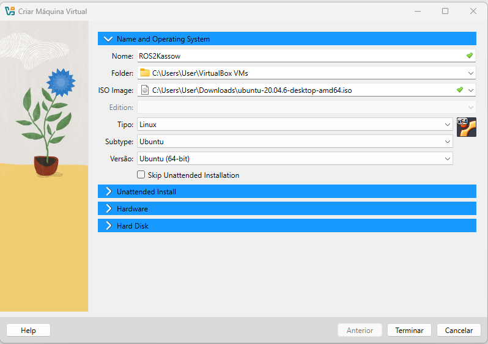

- Setup user name and password

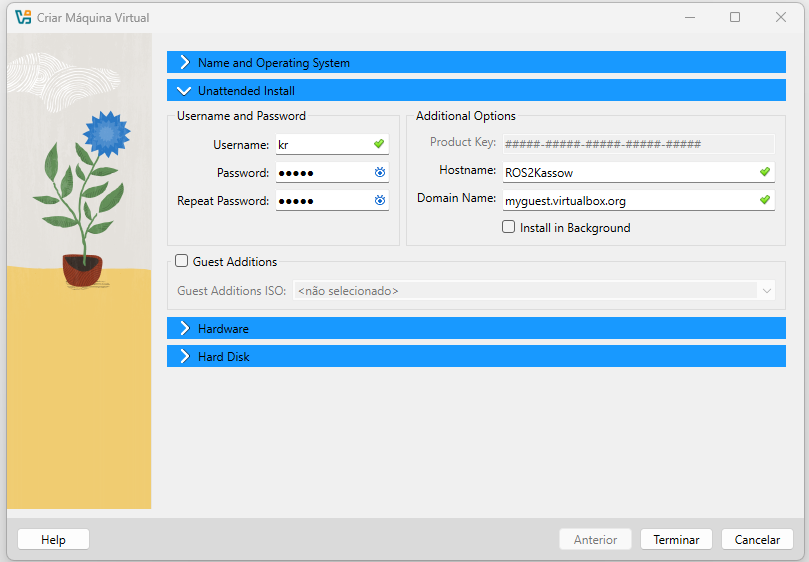

- Configure machine specs

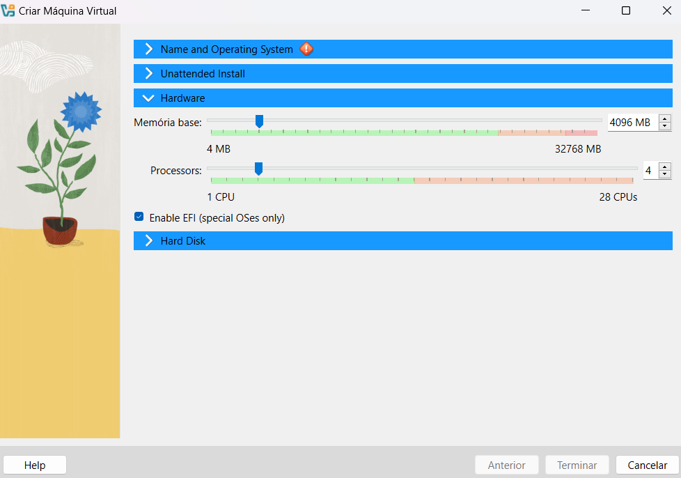

- After the VM is ready, shut it down to configure the network (this can be done later but is better to complete rigth away)

    - Setup one adapter to bridge to the laptop host ethernet port:

    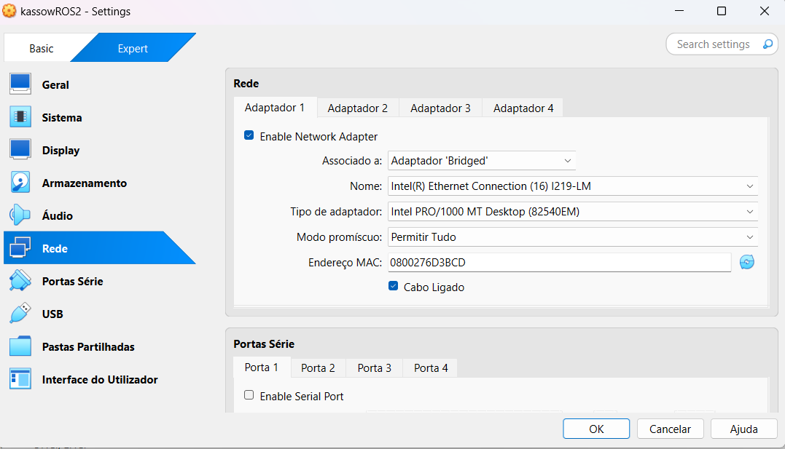

    - And another adaptor to bridge with the wifi devices:

    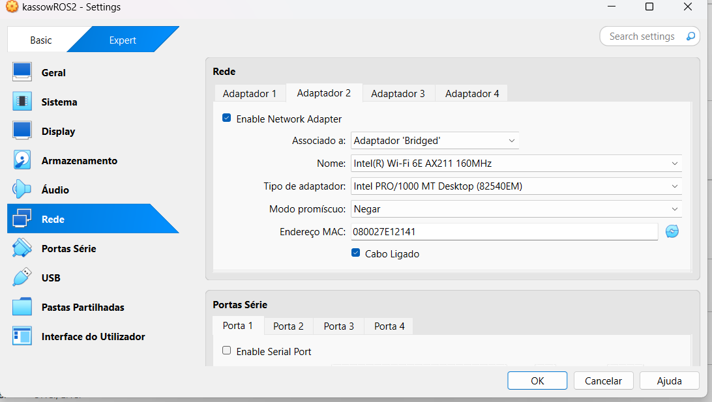

- Start the VM and log in:

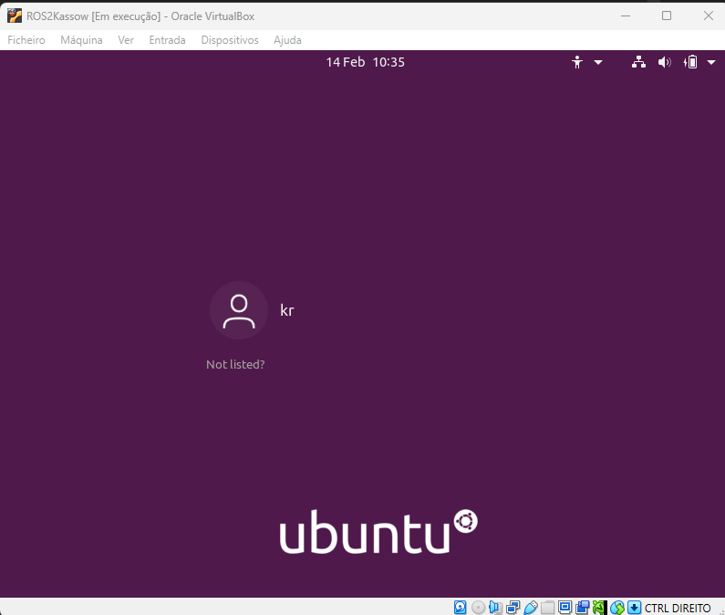

- Configure a static IP on the VM ethernet interface:

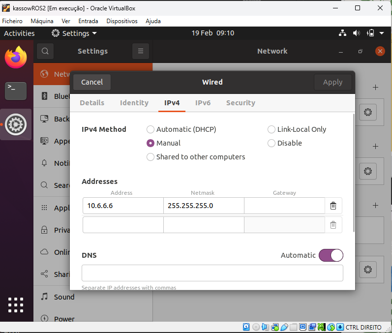

- Open terminal:

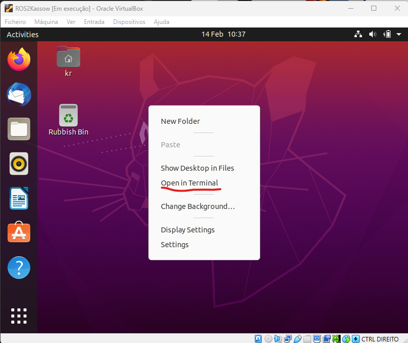

- run update:

    sudo apt update

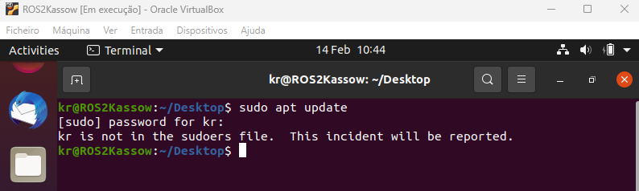

- note: If you dont have sudoer permissions, do:

    su -

    visodu

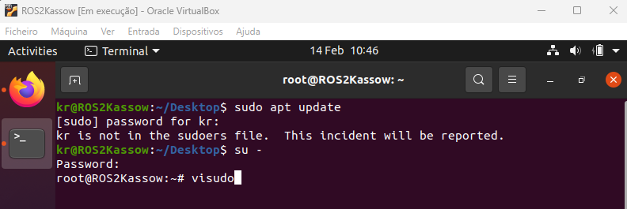

- It will open a configuration file. Search for a line with:

    %sudo ALL=(ALL:ALL) ALL

and add bellow:

    %kr ALL=(ALL:ALL) ALL

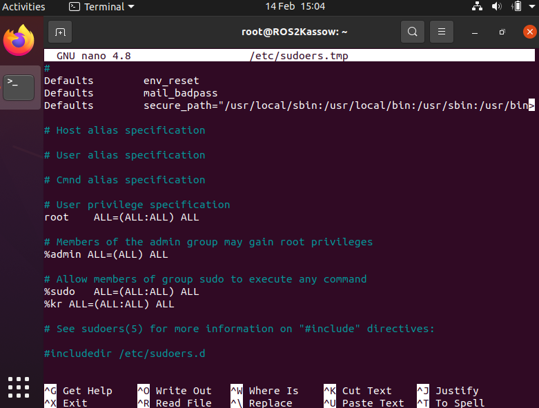

- Update should now run.

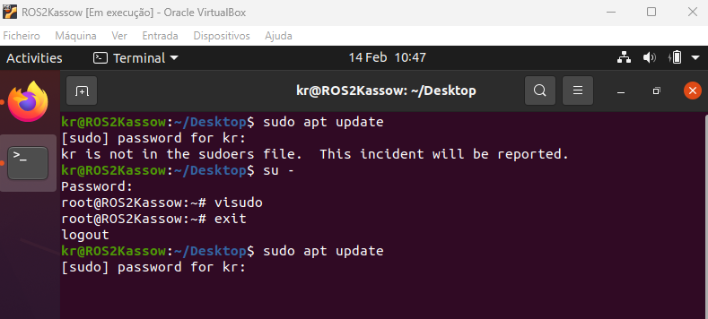

- Go to ros2 distro instalation site (https://docs.ros.org/en/foxy/Installation/Ubuntu-Install-Debians.html). Follow instalation instructions for Debian binarys:

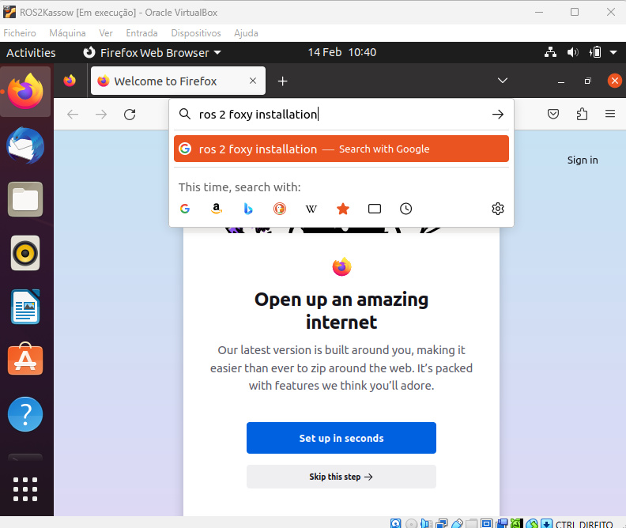

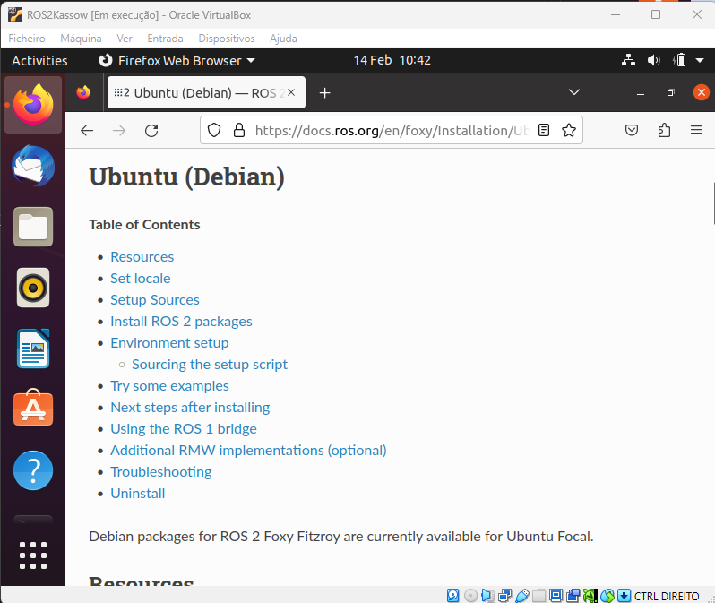

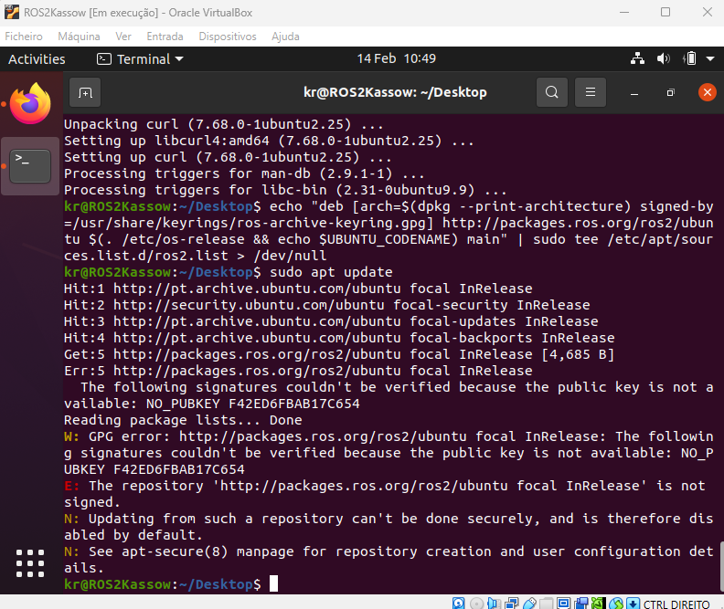

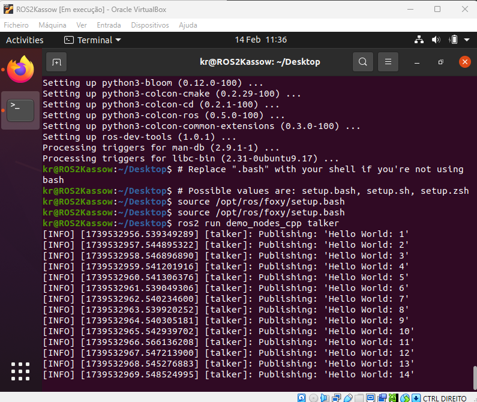

- Go to ROS2 for Kassow Robots gitlab (https://gitlab.com/kassowrobots/orange-ros2):

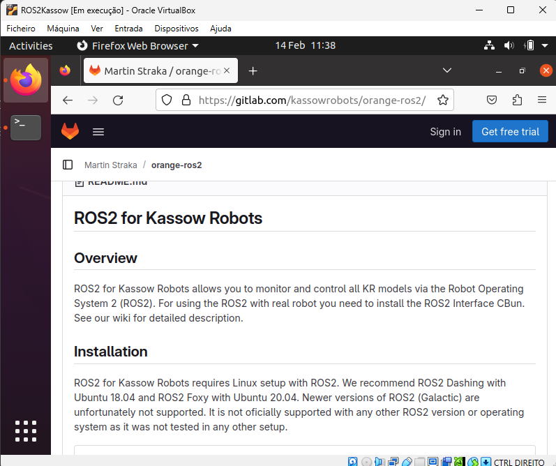

- Take care for the folowing notes.

    - Create the work env. directorys:

    sudo mkdir -p ~/dew_ws/src

    - Souce with the correct ROS distro (foxy for the teste instalation):

    sudo source /opt/ros/foxy/setup.bash

    - Add sudo for the git clone of the repo:

    sudo git clone https://gitlab.com/kassowrobots/orange-ros2.git

    colcon build

- Finaly

    . install/setup.bash

### Setup network adress for host and VM:

- Setup host (windows laptop) IP:

## 
## Kassow robot Setup

- Install ROS2 CBUN (by default on the robot CBUN options)

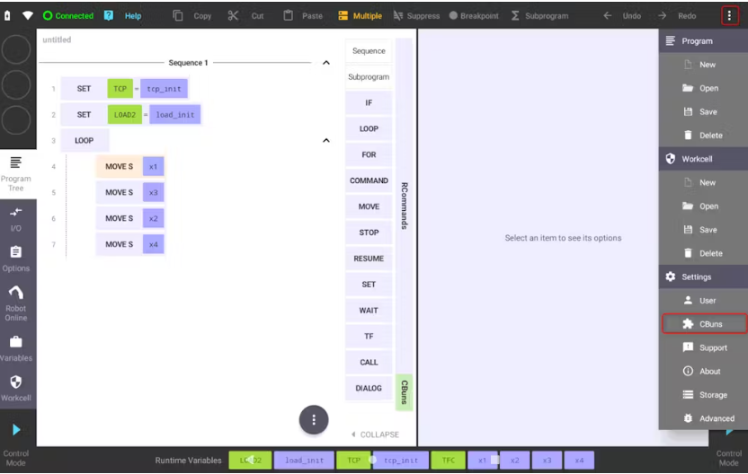

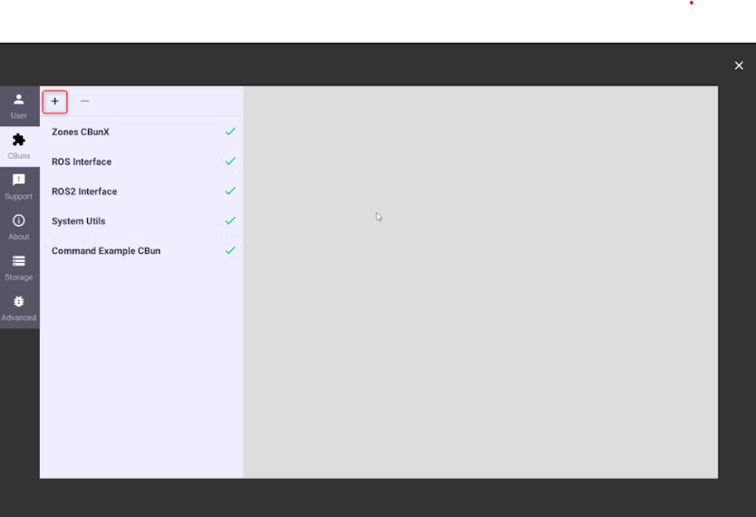

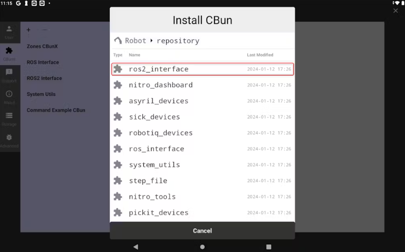

- Press activate to start conection:

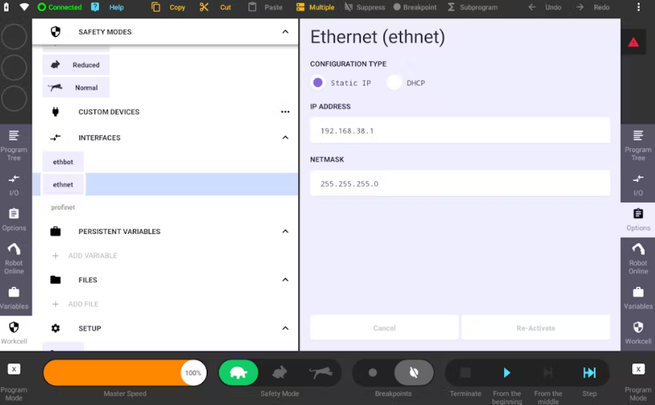

- To check conenction, ping the robot from the VM:

    sudo ping 192.168.38.1

##
## For some examples
### More on "orange-ros2" gitlab

- System State

    ros2 topic echo /kr/system/state

- Jogging

    ros2 topic pub -r 20 /kr/motion/jog_joint kr_msgs/msg/JogJoint "jsvel: [30.0, 0.0, 0.0, 0.0, 0.0, 0.0, 0.0]"

- Services

    ros2 service call /kr/iob/set_digital_output  kr_msgs/SetDiscreteOutput "index: 1
    value: 1"

##
## Helpful Links:

https://docs.ros.org/en/foxy/Installation/Ubuntu-Install-Debians.html

https://gitlab.com/kassowrobots/orange-ros2
