# ctrlX Works plc programing tool instalation

### Go to the ctrlX works site:
https://apps.boschrexroth.com/microsites/ctrlx-automation/en/portfolio/ctrlx-works/

### Download ctrlX Works:
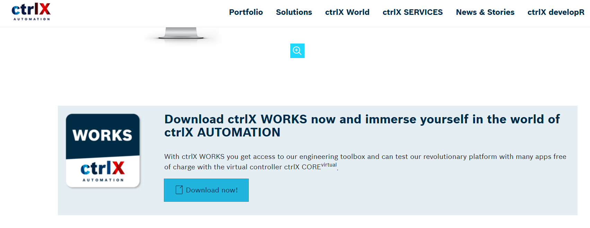

### Select location (Europe + Germany will usualy have the available content):
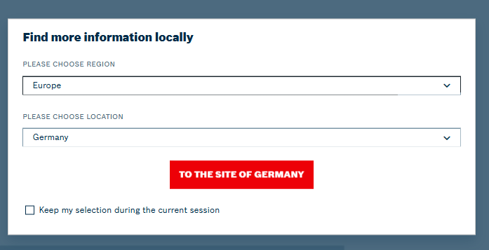

### Download ctrlX Works instalation files:
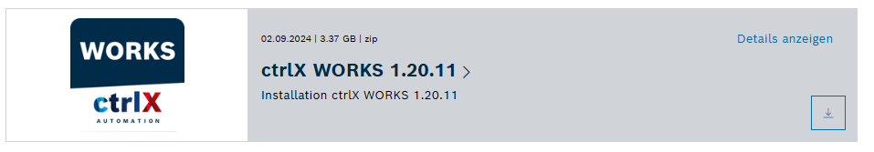
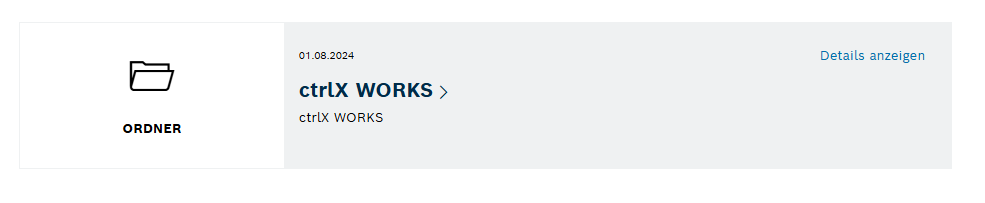

### Download ctrlX Works instalation files:
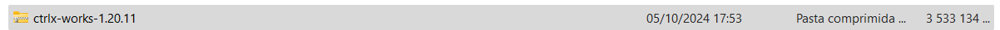
Run "ctrlx-works-X.XX.XX":
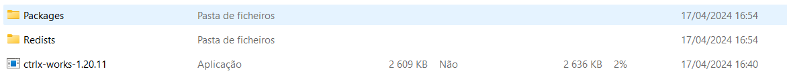

### Proceed with instalation:
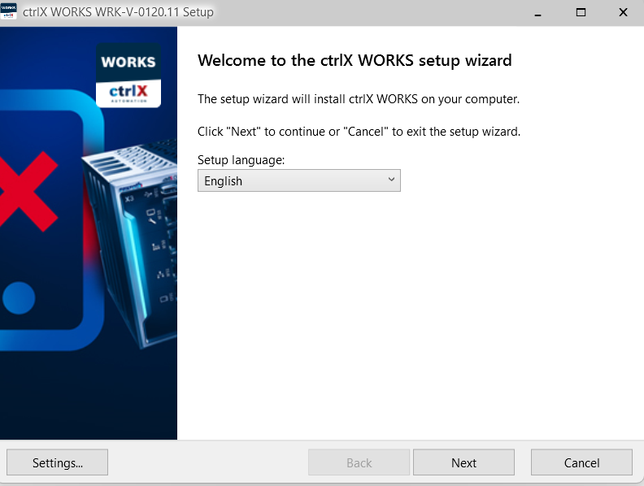

### Open ctrlX Works:
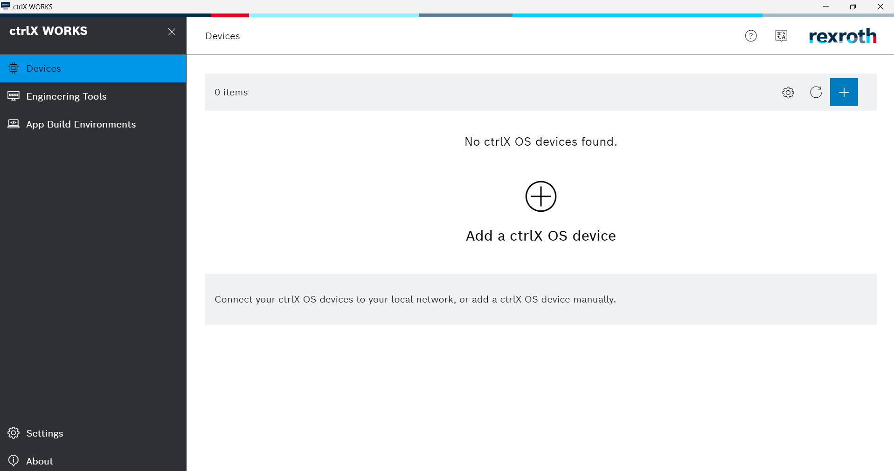

### Add a virtual ctrlX:

### Make sure virtual core is running and press the ip address link:
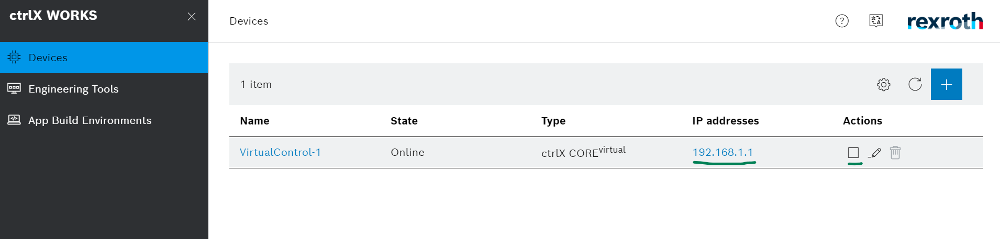

default password is "boschrexroth"

### Virtual core landing page:

Go to ctrlX store:
https://developer.community.boschrexroth.com/t5/Store-and-How-to/bg-p/dcdev_community-dev-blog/label-name/rex_c_Store

and download some APP for test.
note: contact Equinotec for more information.

### Install APP from file:
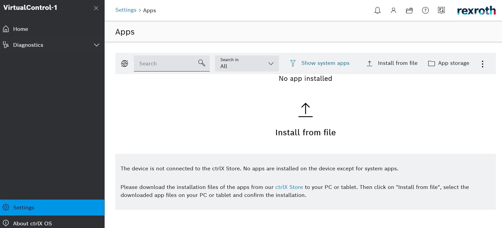

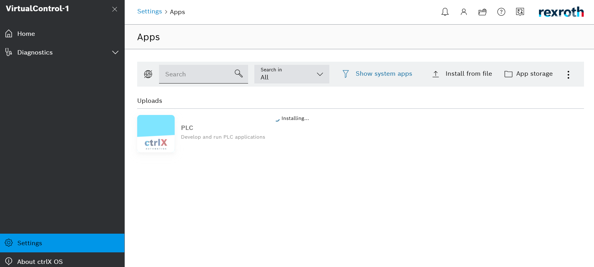

### Check PLC APP:
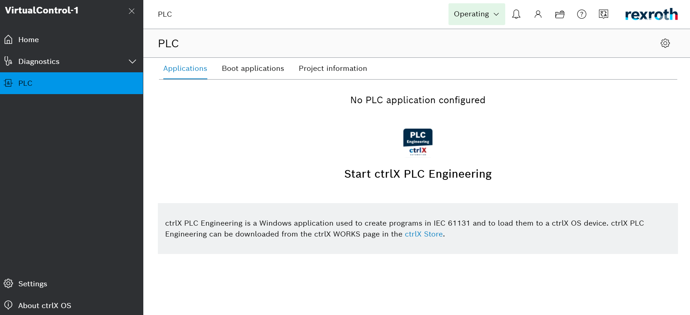
